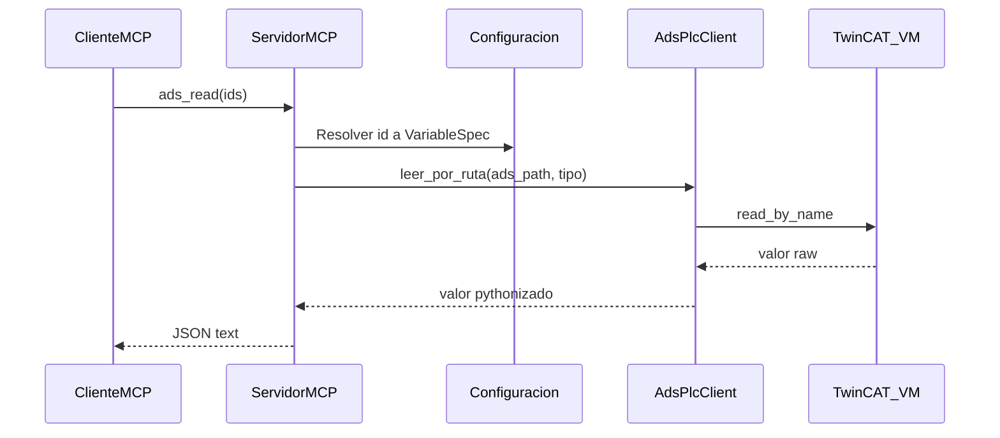

# Arquitectura del servidor MCP ADS

Este documento describe las capas del proyecto y el flujo de una operación típica.

## Capas

1. **MCP (stdio)**  
   El proceso expone el protocolo MCP por entrada/salida estándar. El cliente (por ejemplo Cursor) lanza el proceso y envía mensajes JSON-RPC encapsulados según MCP.

2. **Herramientas MCP** (`mcp_ads/server.py`)  
   Traducen llamadas del modelo (`ads_read`, `ads_write`, `ads_status`, `ads_browse_symbols`) a llamadas al cliente ADS. Solo se permiten variables cuyo `id` existe en `variables.json` (lista blanca).

3. **Cliente ADS** (`mcp_ads/ads_connection.py`)  
   Encapsula `pyads.Connection`: apertura perezosa, reintento sencillo y cierre al terminar el proceso. La importación de `pyads` es **diferida** hasta la primera operación que requiera DLL/adslib.

4. **Configuración** (`mcp_ads/config.py`)  
   Carga `plc.json` y `variables.json` desde el directorio `MCP_ADS_CONFIG_DIR` (o el directorio de trabajo actual). Valida contra JSON Schema embebido en `mcp_ads/schemas/`.

5. **Tipos PLC** (`mcp_ads/plc_types.py`)  
   Mapea nombres de tipo declarados en JSON a tipos `ctypes` compatibles con pyads, y normaliza valores de escritura antes de enviarlos al PLC.

## Flujo de lectura

## Flujo de escritura

- Se comprueba `access == read_write`.
- El valor se normaliza con `normalizar_valor_escritura` según `plc_type` y `string_length` (para `STRING`).
- Se llama a `write_by_name` con el descriptor de tipo resuelto.

## Seguridad y límites

- No hay autenticación MCP en stdio: quien pueda ejecutar el comando controla el PLC (mitigación operativa: permisos de SO, segmentación de red).
- Las rutas ADS **no** se aceptan libremente del modelo: solo `ads_path` asociadas a `id` en configuración.
- `ads_read` limita el número de `ids` por llamada para no saturar el runtime.
- `ads_browse_symbols` puede devolver muchos símbolos; use `limit` y `prefix` con cuidado en producción.

## Fases

- **MVP**: lectura/escritura con JSON y `ads_status`.
- **Fase 2 (implementada como herramienta)**: `ads_browse_symbols` vía `get_all_symbols` (comportamiento dependiente de TwinCAT 2/3; ver [twincat-tc2-tc3.md](twincat-tc2-tc3.md)).
